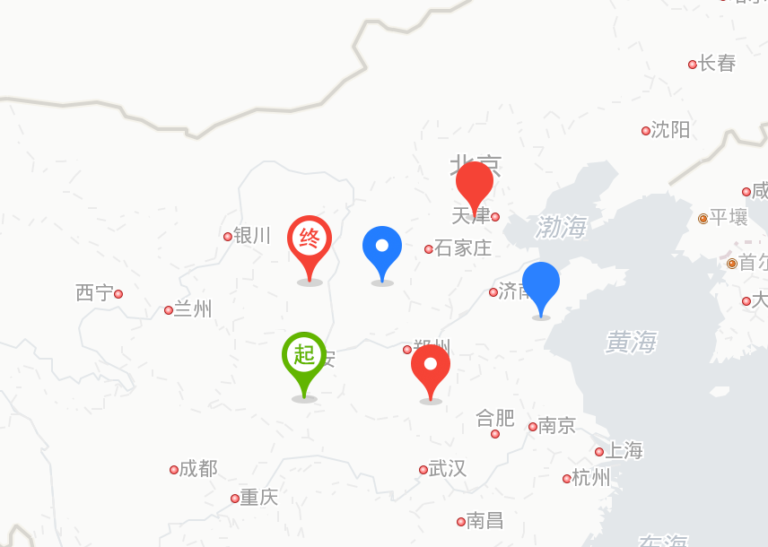
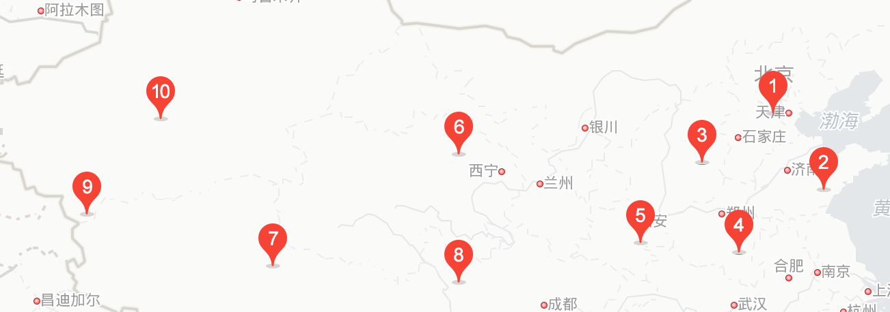
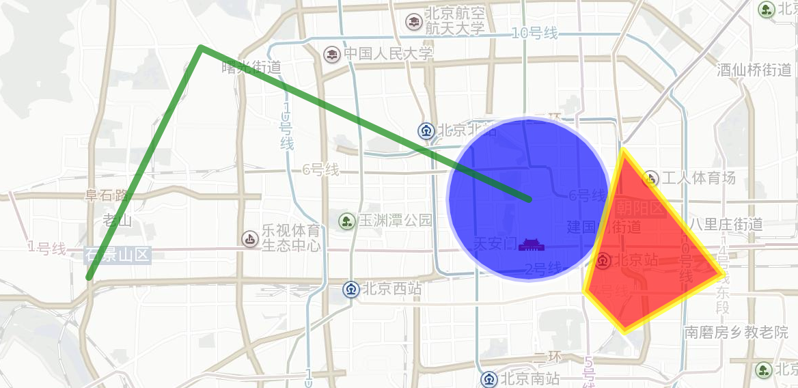
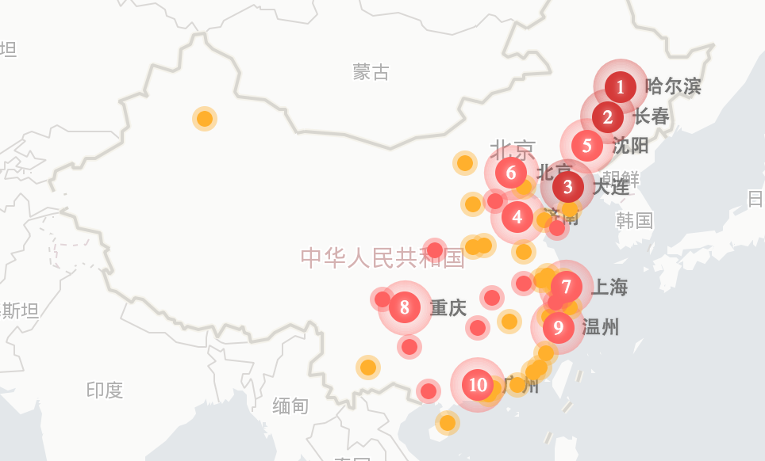

# [React-BMap](https://huiyan-fe.github.io/react-bmap/) 

基于百度地图JavaScript Api封装的React组件库，使用这个库最好需要先了解[React](https://facebook.github.io/react/)和[百度地图JavaScript Api](http://lbsyun.baidu.com/index.php?title=jspopular)。

React-BMap只是利用了React组件的生命周期，来调用对应的百度地图JavaScript Api的方法，比如在componentDidMount和componentDidUpdate的时候在地图上添加覆盖物，componentWillUnmount的时候移除覆盖物，React对应的render渲染函数模块返回的是null。所以这里面地图相关的dom并不是react渲染的，真正创建地图之类的还是使用百度地图JavaScript Api，React-BMap只是利用了React组件的写法来封装百度地图JavaScript Api，使我们在使用React的时候能更方便的使用百度地图JavaScript Api。

## 示例
可查看示例文件夹下的示例使用[示例代码](https://github.com/huiyan-fe/react-bmap/tree/master/docs/examples)，示例效果可访问[预览地址](https://huiyan-fe.github.io/react-bmap/examples/)

## 安装使用

### 页面头部需加载百度地图JavaScript Api代码

    

密钥可去[百度地图开放平台官网](http://lbsyun.baidu.com/apiconsole/key)申请

### 推荐使用npm方式安装使用，然后通过es6模块加载

    npm install react-bmap

### 支持UMD规范的打包库

    

入口命名空间window.ReactBMap [示例预览](http://huiyan-fe.github.io/react-bmap/examples/umd.html) [示例源码](https://github.com/huiyan-fe/react-bmap/blob/master/docs/examples/umd.html)

## Hello World

    import {Map, Marker, NavigationControl, InfoWindow} from 'react-bmap'

    <Map center={{lng: 116.402544, lat: 39.928216}} zoom="11">
        <Marker position={{lng: 116.402544, lat: 39.928216}} />
        <NavigationControl /> 
        <InfoWindow position={{lng: 116.402544, lat: 39.928216}} text="内容" title="标题"/>
    </Map>
    
## 基础地图组件文档
### [Map](./src/components/map.md)

    <Map center={{lng: 116.402544, lat: 39.928216}} zoom="12" />

### [Marker](./src/components/marker.md)

    <Marker position={{lng: 116.402544, lat: 39.928216}}/>

### [Control](./src/components/control.md)

    <NavigationControl />
    <MapTypeControl />
    <ScaleControl />
    <OverviewMapControl />

### [InfoWindow](./src/components/infowindow.md)

    <InfoWindow position={{lng: 116.402544, lat: 39.928216}} text="信息窗口内容" title="信息窗口标题"/>

## 图形组件，圆形、折线、多边形组件

### Circle

    <Circle 
        center={{lng: 116.403119, lat: 39.929543}} 
        fillColor='blue' 
        strokeColor='white' 
        radius="3000"
    />

### Polyline

    <Polyline 
        strokeColor='green' 
        path={[
            {lng: 116.403119, lat: 39.929543},
            {lng: 116.265139, lat: 39.978658},
            {lng: 116.217996, lat: 39.904309}
        ]}
    />

### Polygon

    <Polygon 
        fillColor='red' 
        strokeColor='yellow' 
        path={[
            {lng: 116.442519, lat: 39.945597},
            {lng: 116.484488, lat: 39.905315},
            {lng: 116.443094, lat: 39.886494},
            {lng: 116.426709, lat: 39.900001}
        ]}
    />

## 其它一些场景组件

### MarkerList

    <MarkerList 
        data={[
            {
                text: "长沙大道",
                location: "113.22183,28.191712"
            },
            {
                text: "机场高速",
                location: "113.057565,28.175208"
            }
        ]} 
        fillStyle="#ff3333" 
        animation={true} 
        isShowShadow={false} 
        multiple={true} 
        autoViewport={true}
    />

### MapvLayer

    <MapvLayer data={[]} options={{}} />

### Road

    <Road roadPath={['116.330484,40.031406,116.33124,40.029496,116.33124,40.029496']}/>

### Boundary 

    <Boundary data={[
        {
            name: '海淀区',
            count: 20
        },
        {
            name: '朝阳区',
            count: 10
        }
    ]}/>

### TrafficLayer 交通路况图层 <a href="https://github.com/huiyan-fe/react-bmap/blob/master/docs/examples/components/traffic-layer.js">示例代码</a>
    <TrafficLayer />

## 许可证
[MIT](./LICENSE)
